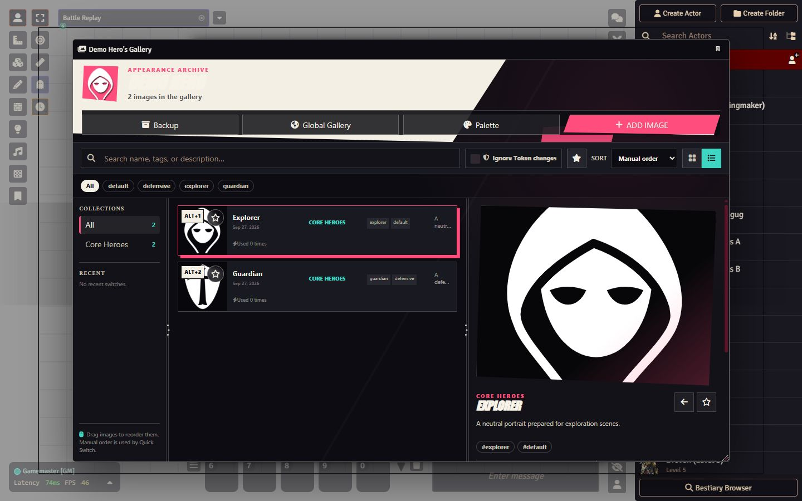
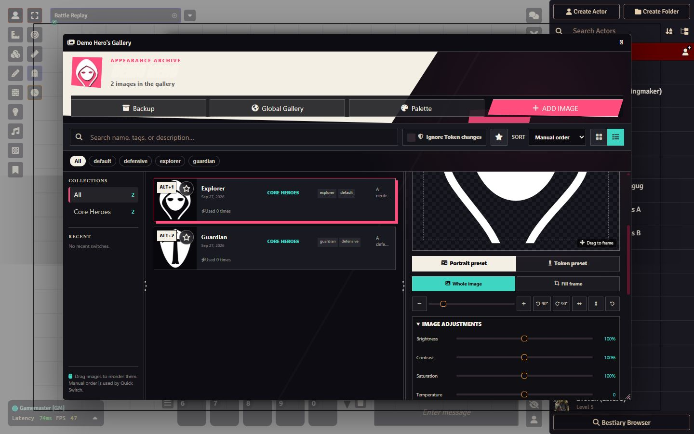
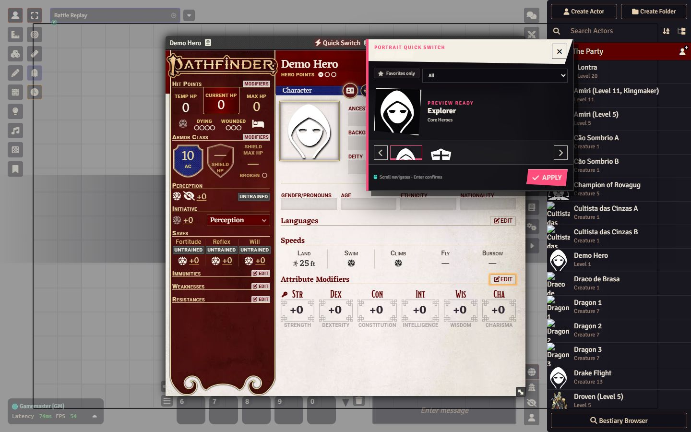
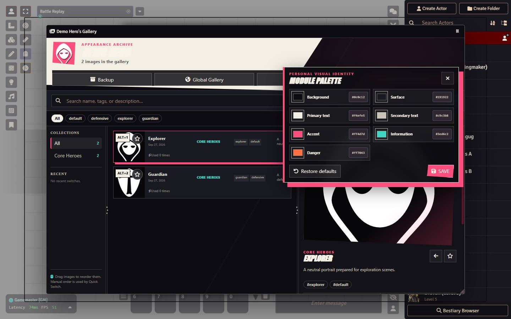
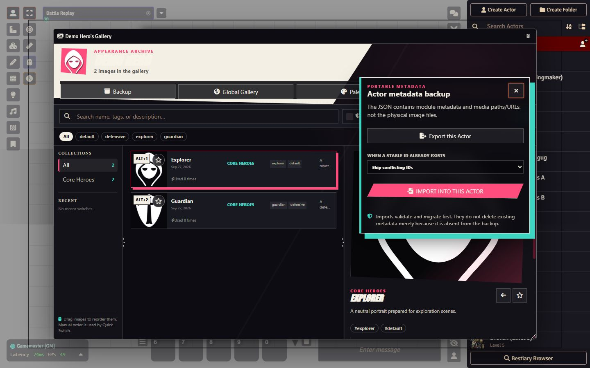

# Actor Image Gallery — Free Distribution

Public distribution repository for the Free edition of **Actor Image Gallery**, a system-agnostic Foundry VTT module for organizing Actor images, editing non-destructive portrait/token presets, and switching appearances quickly.

## Install in Foundry VTT

Use this manifest URL in **Add-on Modules → Install Module → Manifest URL**:

```text
https://github.com/LucasChlz/Foundry-Actor-Image-Gallery-Distribution/releases/latest/download/module.json
```

The release assets contain only the Foundry runtime (`scripts`, `styles`, `lang`, `module.json`, and `LICENSE`). Development files, tests, internal documentation, entitlement experiments, and Patreon implementations are not included.

## Free features

- per-Actor image galleries with search, tags, collections, favorites and manual ordering;
- drag-and-drop image addition and reordering;
- non-destructive portrait and Token framing presets;
- independent Portrait/Token application targets and the gallery Token guard;
- Quick Switch from Actor sheets, Token HUD, hotkeys and quick slots;
- global GM-managed image gallery;
- temporary appearances with safe revert;
- metadata backup/import for Actor, global gallery and world;
- custom color palette and resizable gallery layout;
- stable public API for integrations.

Appearance profiles, sequences, automation rules and the radial selection wheel are not shipped in this public package. They belong to the separate Patreon companion.

## Screenshots

### Actor gallery



### Non-destructive Portrait and Token editor



### Quick Switch



### Custom color palette



### Metadata backup and import



## Editions

- **Free:** the public package available here.
- **Patreon:** premium extensions are developed in a separate private repository and use the Free module as their required base.

Issues for the distributed module can be reported in this repository.

## Release integrity

Each release includes:

- `module.json`
- `actor-image-gallery-VERSION.zip`
- `actor-image-gallery-VERSION.zip.sha256`

The checksum can be used to verify that the downloaded ZIP matches the validated build.
